## Challenges with Aurora PSQL

---

### Andraz Brodnik aka. brodul

- 15+ YOE 👴
- Worked in AWS ☁️ back and forth from 2010
- Multiple roles trough my career 🃏 :arrow_right:

---


---

## Situation 1/2

- Joined a company 👋
- Got tasked to move tenants from Cockroach DB to AWS RDS Aurora (Postgres engine) :nerd_face:
- Each tenant own database :inbox_tray:

---

## Situation 2/2

- Cockroach is almost compatible Postgres database 🤌
- Distributed across nodes (uses SSTables) 🪄
- StatefulSet in EKS 🪚 
- Super amazing colleges (SRE and Platform) 🧑‍🤝‍🧑

---

## AWS RDS Aurora

- Database as a service 💸
- Proprietary / supports MySql and Postgres 🕵️
- 3x throughput 🐴
- Storage layer is abstracted away 💾 ❇️ 
- Synchronization over storage ☎️
- Cheaper 🤑

---

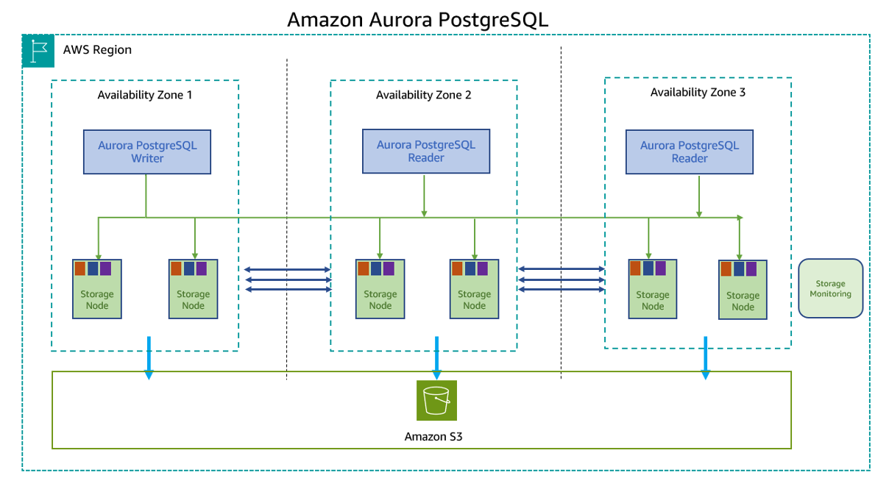

---

...

---

... it's one less thing we have to maintain 💯

---

## Context

- use aurora-postgres engine
- use `provisioned` instead of `serverless`
- Terraform

---

## Pricing 💸

- Storage is basically free
- You pay for the compute/instances and IOPS
- With IO optimized storage type you don't pay for IOPS, but you pay 30% premium on the instances

---

## Naming / API namespacing 

- Everything is RDS 🥇🥇
- RDS CreateDBCluster api call for example


---

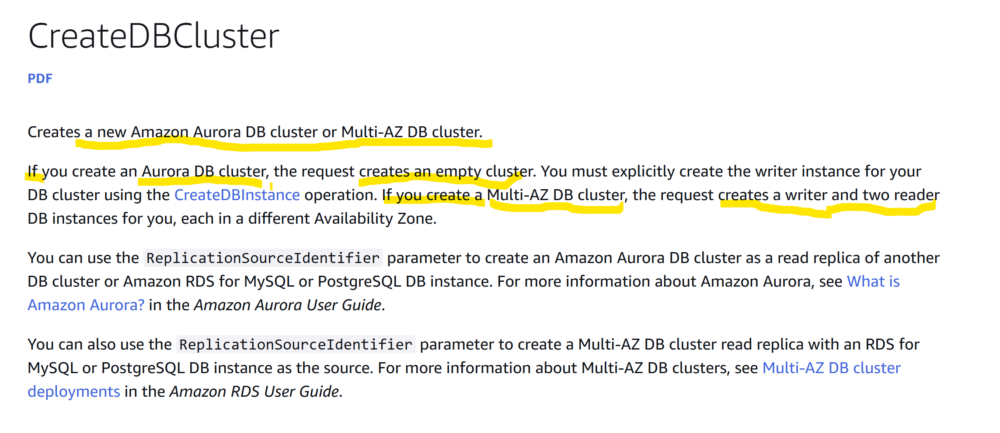

---

```python
def create_cluster(is_aurora=False, **args):
    if is_aurora:
        something()
    elif not is_aurora:
        something_else()
```

---

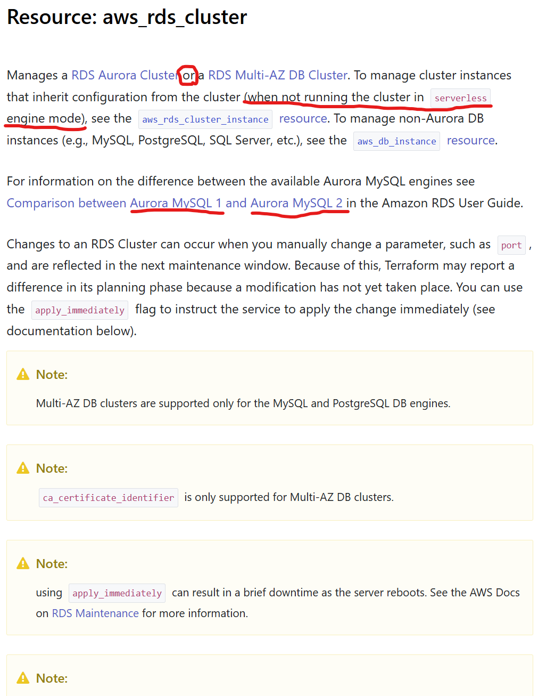

---

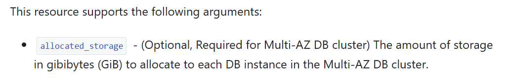

---

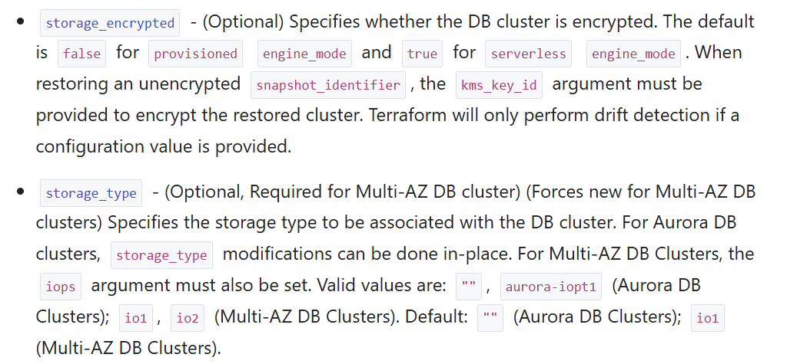

---

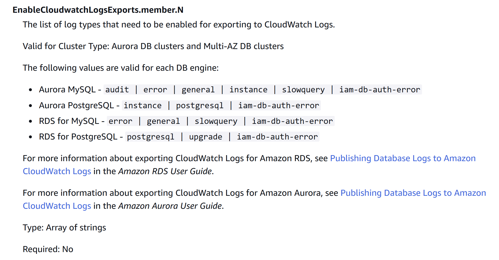

---

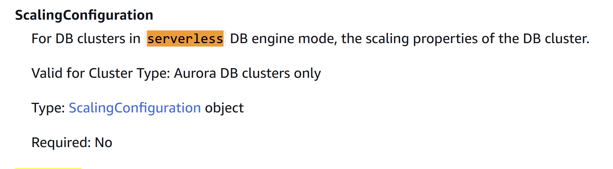

---

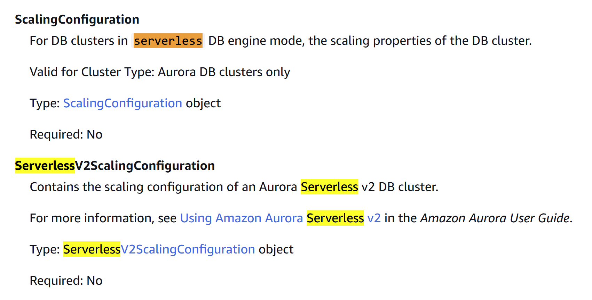

---

🥲

---

## Everyone is a bit confused
---

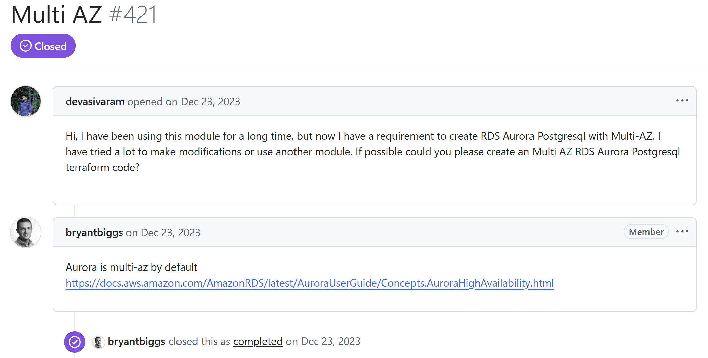

---

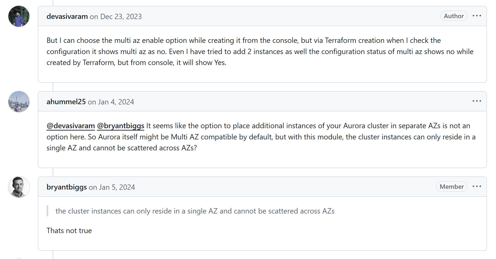

---


---

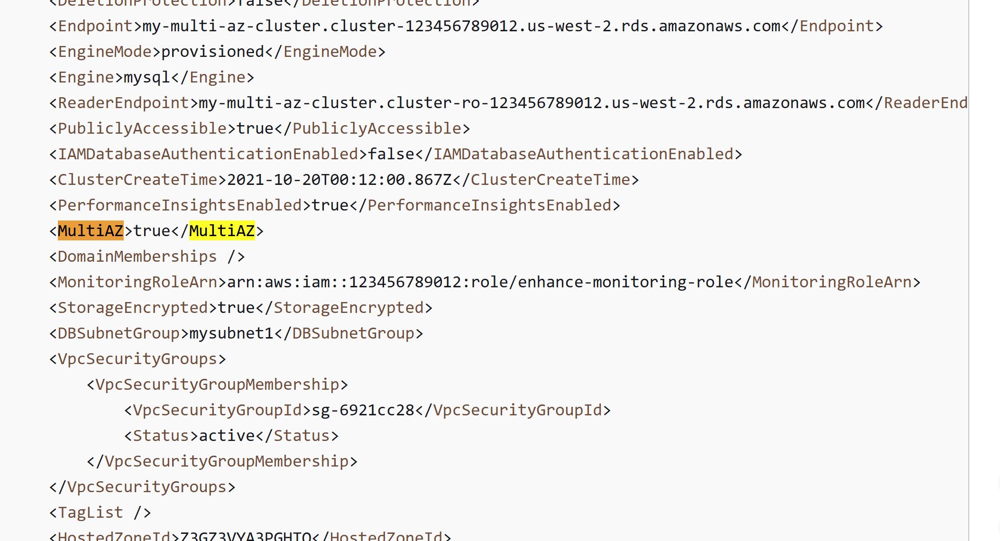

---


```python
def create_cluster(is_aurora=False, **args):
    if is_aurora:
        something()
        if context_web_console:
            multi_az = True
```


---


---

RDS proxy

---

monitoring

---
